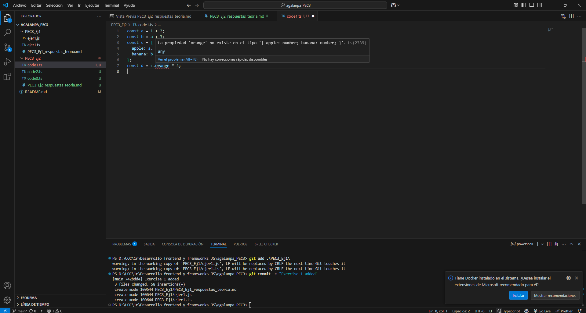

# Modificar el código para disparar un TypeError

Al sustituir `c.apple` por `c.orange` se dispara un TypeError, ya que `c` no contiene la propiedad `orange`. Esto ocurre porque TypeScript detecta este tipo de error antes de que el código se ejecute.

# Preguntas teóricas

## Para cada uno de los valores del fichero code2.ts, ¿Qué tipo de datos inferirá TypeScript? Explica por qué se ha inferido este tipo de datos.

* `const a = 1042;` TypeScript detecta que el valor es un número entero e infiere `number`.
* `const b = 'apples and oranges';` TypeScript detecta que el valor es una cadena de texto e infiere `string`.
* `const c = 'pineapples';` TypeScript detecta que el valor es una cadena de texto e infiere `string`.
* `const d = [true, true, false];` TypeScript detecta que el valor es un array de booleanos e infiere `boolean[]`.
* `const e = { type: 'ficus' };` TypeScript detecta que el valor es un objeto con una clave `type` de tipo `string` e infiere `{ type: string }`.
* `const f = [1, false];` TypeScript detecta que el valor es un array que contiene números y booleanos e infiere `(number | boolean)[]`.
* `const g = [3];` TypeScript detecta que el valor es un array con un número e infiere `number[]`.
* `const h = null;` TypeScript detecta que el valor es `null`, dependiendo de la configuración del compilador infiere `any` o `null`.

La inferencia de tipos en TypeScript ayuda a evitar errores al escribir código más seguro sin necesidad de definir manualmente los tipos.

## ¿Por qué se dispara cada uno de los errores del fichero code3.ts?

* **Error TS2588:** `i` está declarado para que solo pueda tener el valor 3. Al intentar asignarle el valor 4, TypeScript lanza un error por intentar cambiar el valor de `i`. Además, `i` es una constante y no se puede reasignar su valor.
* **Error TS2345:** TypeScript infiere que `j` es un array numérico. Al intentar hacer `j.push('5')`, TypeScript detecta que `'5'` es un `string`. Esto no coincide con el tipo del array `number[]` y produce un error.
* **Error TS2322:** En TypeScript, `never` es un tipo especial que no permite que una variable tenga un valor válido. En este caso, se declara `k` como `never` y se le intenta asignar el valor 4. Entonces, TypeScript lanza un error porque ningún valor es compatible con `never`.
* **Error TS2571:** `l` se declara con el tipo `unknown`, por lo que puede ser de cualquier tipo. Sin embargo, TypeScript no permite operaciones directas con variables de tipo `unknown` sin antes comprobar su tipo. Es decir, TypeScript no sabe si `l` es en realidad un número y no permite realizar la multiplicación directamente.

## ¿Cuál es la diferencia entre una clase y una interface en TypeScript?
Una interfaz sirve para definir la estructura de un objeto sin implementación en tiempo de compilación. Se pueden declarar propiedades, métodos y tipos, pero no se implementan. En cambio, las clases sirven para implementar lógica y crear instancias en tiempo de ejecución. Pueden tener implementaciones, modificadores de acceso, herencia y pueden implementar interfaces.